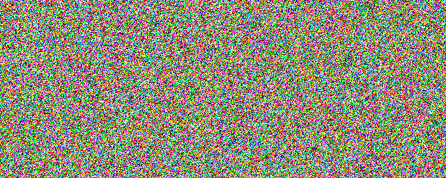
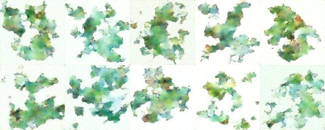
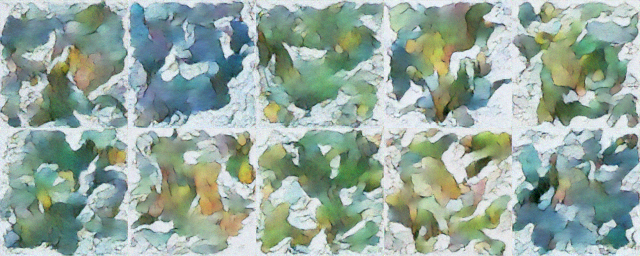
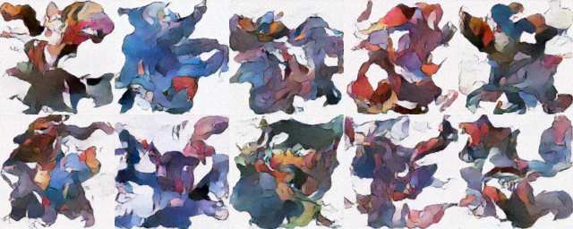
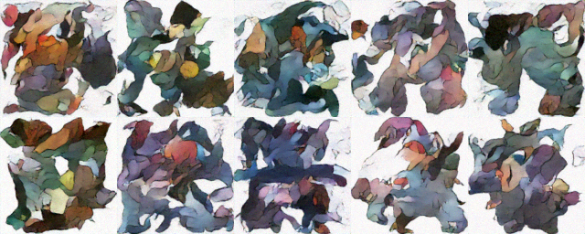

# Simple Implantation of DDPM (For Tutorial)

## Welcome Pokemon DDPM for Tutorial!

Recently I have been investigating DDPM. And I hope this code can help all beginners to better learn DDPM!

**NOTE:** Perspective Video is coming! (I will make slides to introduce this repo and the link is coming soon.)

## How to run

I have uploaded all data and code to repo. (Don't worry)

Clone this repo

`git clone https://github.com/jameskuma/Simple_Diffusion.git`

Before running

`pip install diffusers transforms wandb`

Don't forget to register your count on https://wandb.ai/site

Finallly, open the terminal and input

`pytho run.py`

## Some Experimental Results

